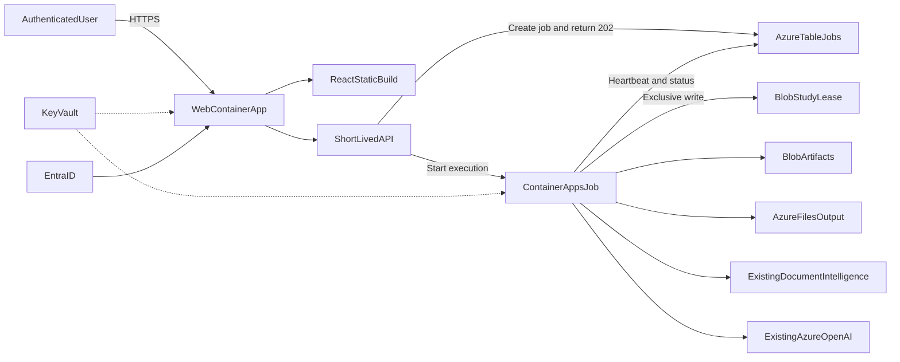

---

name: atomic-azure-deployment
overview: Deploy PD Check Factory as one Entra-protected, same-origin web Container App plus a separate manual Container Apps Job for long work. Reuse the existing Storage, Azure OpenAI, and Document Intelligence resources; add Table/File storage, Blob locking, Bicep infrastructure, and GitHub Actions without introducing PostgreSQL or Service Bus.
todos:

- id: job-foundation
content: Define job contracts, Table Storage repository, Entra ownership, and distributed study locking with tests
status: pending
- id: pipeline-worker
content: Extract long-running pipeline runners and add the Container Apps Job CLI entry point
status: pending
- id: artifact-concurrency
content: Add immutable job snapshots, conditional promotion, and ETag-protected review writes
status: pending
- id: async-api-ui
content: Implement 202 job APIs and migrate the React job UX to durable polling and resume
status: pending
- id: same-origin-image
content: Build and verify one production image serving the React SPA and API, with a job command override
status: pending
- id: azure-bicep
content: Provision reusable Azure foundation and web/job resources using Bicep and existing AI/storage services
status: pending
- id: github-delivery
content: Add OIDC-based GitHub CI/CD, immutable image deployment, smoke tests, and rollback
status: pending
- id: production-validation
content: Exercise timeout, concurrency, restart, auth, failure, persistence, and operational recovery scenarios
status: pending
isProject: false

---

# Atomic Azure Deployment Plan

## Target architecture

Decisions:

- Reuse the existing Blob Storage account/container, Azure OpenAI, and Document Intelligence resources.
- Add a Table and Azure Files share to the existing Storage Account.
- Provision ACR, Key Vault, managed identities, Log Analytics, Container Apps Environment, web app, and manual job with Bicep.
- Use GitHub Actions with Azure federated OIDC; do not store Azure deployment credentials in GitHub secrets.
- Keep `maxReplicas=1` for the web app initially, but enforce correctness with storage-level concurrency controls.
- Do not try to extend the 240-second ingress request limit. Every potentially long request must become a durable asynchronous job.

## Atomic increments

### 1. Freeze the job contract and concurrency policy

- Add an architecture/runbook document at [docs/azure-deployment.md](docs/azure-deployment.md).
- Define `runId` as the existing pipeline configuration/version and `jobId` as a unique execution attempt; never use a user name or browser session in artifact paths.
- Define statuses `queued`, `starting`, `running`, `succeeded`, `failed`, and `cancelled` plus timestamps, heartbeat, progress, error summary, Container Apps execution name, artifact prefix, and Entra `ownerOid`.
- Define initial access policy: every authenticated tenant user retains current study visibility; only the job owner or an Admin app role may cancel/retry a job.
- Define one mutating job per study. Concurrent reads are allowed; a second mutation returns `409` with the active `jobId`.

### 2. Add durable job metadata and distributed locking

- Add `azure-data-tables` and `azure-mgmt-appcontainers` to [pyproject.toml](pyproject.toml).
- Add [pdcheck_factory/jobs/models.py](pdcheck_factory/jobs/models.py), [pdcheck_factory/jobs/table_store.py](pdcheck_factory/jobs/table_store.py), [pdcheck_factory/jobs/aca_dispatcher.py](pdcheck_factory/jobs/aca_dispatcher.py), and [pdcheck_factory/jobs/study_lock.py](pdcheck_factory/jobs/study_lock.py).
- Store job rows with `PartitionKey=studyId`, `RowKey=jobId`; reserve `RowKey=LOCK` using conditional insert/ETag before dispatch so two requests cannot both start.
- Have the worker acquire and renew a finite Blob lease before modifying study artifacts. Release both lease and lock in `finally`; use heartbeat expiry plus Container Apps execution state for stale-lock recovery.
- Keep full logs in Blob and only bounded progress/error metadata in Table Storage.
- Add unit tests for conditional creation, ETag conflicts, lease renewal/release, stale recovery, owner authorization, and idempotent retry.

### 3. Extract a reusable pipeline worker

- Move long-running orchestration out of [pdcheck_factory/ui_api/service.py](pdcheck_factory/ui_api/service.py) into [pdcheck_factory/pipeline_runner.py](pdcheck_factory/pipeline_runner.py), while retaining thin synchronous wrappers until cutover.
- Cover `extract-inputs`, protocol/aCRF preprocessing, pipeline steps, per-rule deduplication, bulk pseudo-logic, and any `sync/load` operation that can exceed a short web request.
- Add `pdcheck job run --study-id ... --job-id ...` in [pdcheck_factory/cli.py](pdcheck_factory/cli.py). The command loads its trusted payload from Table Storage, acquires the study lease, updates heartbeat/progress, executes the existing pipeline functions, records outputs, and terminates with a meaningful exit code.
- Preserve existing progress callbacks and compatibility updates to `ui_pipeline_run_state.json` during migration.
- Verify each runner produces the same canonical artifacts and step-version snapshots as the existing HTTP implementation.

### 4. Introduce immutable execution snapshots without rewriting the whole pipeline

- Keep current canonical working paths in [pdcheck_factory/paths.py](pdcheck_factory/paths.py) under the exclusive study lease so existing pipeline code remains compatible.
- Add helpers for `pipeline/{studyId}/runs/{runId}/jobs/{jobId}/` and write an immutable output manifest/snapshot after successful execution.
- Extend [pdcheck_factory/step_artifact_versions.py](pdcheck_factory/step_artifact_versions.py) and [pdcheck_factory/study_artifact_sync.py](pdcheck_factory/study_artifact_sync.py) to record produced files, hashes/ETags, source versions, and the job that produced them.
- Update the canonical active-version pointer with `If-Match`; return a conflict rather than silently overwriting a newer selection.
- Require ETag/version tokens for interactive review mutations so two users cannot silently overwrite the same review JSON.
- Defer fully parallel branches within one study; the initial product policy serializes all study mutations.

### 5. Add the asynchronous HTTP API and Entra ownership

- Add to [pdcheck_factory/ui_step_api.py](pdcheck_factory/ui_step_api.py):
  - `POST /api/v1/studies/{studyId}/jobs` returning `202`, `jobId`, and `statusUrl`.
  - `GET /api/v1/studies/{studyId}/jobs` for resumable history.
  - `GET /api/v1/studies/{studyId}/jobs/{jobId}` for progress/results.
  - `POST /api/v1/studies/{studyId}/jobs/{jobId}/cancel` for owner/Admin cancellation.
- Parse the trusted Entra principal supplied by Container Apps Authentication and persist its immutable `oid`; provide an explicitly enabled local-development identity fallback, never a production header fallback.
- Dispatch the preconfigured manual Container Apps Job through managed identity with least-privilege `start/read/stop` permissions.
- Put old blocking endpoints behind `PIPELINE_ASYNC_JOBS`; remove/disable their production execution after frontend cutover.
- Add `/healthz` and `/readyz`; liveness checks the process, readiness checks configuration and writable `/mnt/output` without repeatedly calling expensive external services.

### 6. Convert the frontend from an in-memory queue to durable server jobs

- Add job request/response types and client methods in [frontend/src/services/stepApi.ts](frontend/src/services/stepApi.ts).
- Refactor [frontend/src/jobs/PipelineJobContext.tsx](frontend/src/jobs/PipelineJobContext.tsx): submitting a step awaits only the `202`, then polls the job status instead of awaiting the long POST.
- Reuse [frontend/src/hooks/usePipelineRunState.ts](frontend/src/hooks/usePipelineRunState.ts) and existing progress UI during transition, then make `jobId` the primary polling key.
- On application reload, query active/recent jobs for the selected study so closing the browser does not lose progress.
- Refresh artifact/step status after success; show owner, queued/running state, failure details, conflict information, retry, and cancellation.
- Remove the unload warning once no browser-held request is required.
- Add frontend tests for `202`, polling, reload/resume, `409` study lock, terminal failure, cancellation, and transient polling errors.

### 7. Produce one same-origin production image

- Convert [Dockerfile](Dockerfile) to a multi-stage build: Node stage runs `npm ci` and `npm run build`; Python runtime retains Python 3.11 and Java 17 and receives `frontend/dist`.
- Change both [frontend/src/services/stepApi.ts](frontend/src/services/stepApi.ts) and [frontend/src/services/artifactApi.ts](frontend/src/services/artifactApi.ts) to use a relative API base in production while preserving the localhost override for development.
- Extend [pdcheck_factory/ui_step_api.py](pdcheck_factory/ui_step_api.py) to serve static assets and SPA fallback safely, with API routes taking precedence and cache headers for hashed assets.
- Remove wildcard production CORS; allow only explicit development origins when configured.
- Use the same immutable image digest for the web app and job; override the job command to `pdcheck job run`.
- Validate locally: backend tests, frontend lint/test/build, container health, same-origin UI/API, Java availability, and one mocked asynchronous job.

### 8. Provision Azure infrastructure with Bicep

- Add [infra/main.bicep](infra/main.bicep) and modules for foundation and application deployment under [infra/modules](infra/modules).
- Foundation module provisions ACR, Log Analytics, Container Apps Environment, Key Vault, user-assigned identities, Table/File children under the existing Storage Account, and required RBAC.
- Application module provisions:
  - Public web Container App with Entra Easy Auth, one replica, `/mnt/output` Azure Files mount, health probes, Key Vault secret references, and external HTTPS ingress.
  - Manual Container Apps Job with no ingress, the same image/mount/config, one replica per execution, bounded retry count, and a parameterized multi-hour execution timeout.
- Reference existing Storage, Azure OpenAI, and Document Intelligence by parameter; do not recreate or import them destructively.
- Keep existing storage/OpenAI/DI keys or connection string only as interim Key Vault secrets because the current DI SAS path is key-dependent. Use managed identity for ACR pull, Key Vault, ARM job control, and any supported data-plane access; document the later keyless SAS migration.
- Add non-secret dev/prod parameter files. Treat the Entra app registration/client secret as an administrator-provided prerequisite stored in Key Vault; exclude health endpoints from Easy Auth.
- Enable Blob soft delete/versioning where organizational policy permits and document retention settings.

### 9. Add GitHub CI/CD with safe first deployment and rollback

- Add [.github/workflows/ci.yml](.github/workflows/ci.yml) for Python tests plus frontend lint, tests, and production build.
- Add [.github/workflows/deploy.yml](.github/workflows/deploy.yml) using GitHub Environment approval and Azure OIDC.
- Workflow order: Bicep `what-if` → deploy foundation → build/push image tagged by commit SHA → deploy web/job resources with that immutable image → smoke test health/auth/job submission.
- Deploy Container Apps in single-revision mode and retain the prior healthy revision/image for rollback. Never use `latest` as the deployed image reference.
- Separate `dev` and `prod` environments and prevent production deployment unless CI and Bicep validation pass.

### 10. Validate failure modes before production cutover

- Confirm a job lasting longer than 240 seconds returns `202` immediately, survives browser closure, and is visible after login/reload.
- Confirm two simultaneous mutations for one study result in one accepted job and one `409`; confirm different studies can run concurrently.
- Restart/redeploy the web app during an active job and verify the job completes.
- Force worker failure and retry; verify status, lease cleanup, no duplicate version promotion, and retained diagnostic logs.
- Verify Entra: unauthenticated access is denied, tenant restriction works, `ownerOid` cannot be spoofed, and owner/Admin cancellation rules apply.
- Verify secrets do not appear in image layers, GitHub logs, application logs, or Table payloads.
- Validate Azure Files persistence, Blob snapshots/version pointers, DI extraction, OpenAI calls, and rollback to the prior Container App revision.
- Complete operational runbooks for failed jobs, stale locks, manual lease break, retry, cancellation, secret rotation, image rollback, and cost monitoring.

## Cutover and future scaling

- Enable async behavior in dev first, then production via `PIPELINE_ASYNC_JOBS`; keep the old synchronous path only for one rollback window.
- After the rollback window, remove production access to blocking pipeline routes.
- Keep one web replica until every mutable local JSON path is protected by lease/ETag and all durable status is in Table/Blob.
- Scale jobs across different studies only; retain one active mutation per study.
- Introduce PostgreSQL only if requirements expand to relational study ACLs, complex audit/reporting, or simultaneous collaborative editing. Introduce Service Bus only when durable queueing/back-pressure is needed beyond direct manual Job dispatch.

